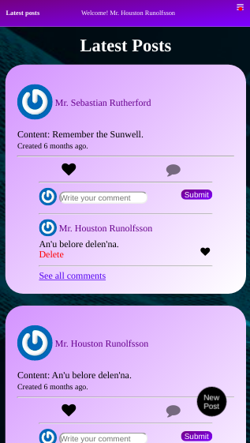

<p align="center">
  <a href="https://raw.githack.com/wathigo/Restaurant-Page/recipe-page/dist/index.html">
    
  </a>

  <h3 align="center">Facebook Clone</h3>

  <p align="center">
    Rails Project
    <br />
    <br />
    <a href="https://librairie.herokuapp.com/">View Demo</a>
    ·
    <a href="https://github.com/wathigo/facebook-clone/issues">Report Bug</a>
    ·
    <a href="https://github.com/wathigo/facebook-clone/issues">Request Feature</a>
  </p>
</p>


<!-- TABLE OF CONTENTS -->
## Table of Contents

* [About the Project](#about-the-project)
  * [Built With](#built-with)
  * [Gettung Started](#getting-started)
* [Contact](#Contact)


<!-- ABOUT THE PROJECT -->
## About The Project
<section align="left">
    
  The purpose of this project is to create an online social </br>
platform where the user can perfom similar actions to </br>
the facebook social network.The application allows user to </br> perfom the folllowing actions:
<ul>
  <li>Sign in/ log in.</li>
  <li>Create posts.</li>
  <li>Comment to posts.</li>
  <li>Like both posts and comments.</li>
  <li>Send friend request.</li>
  <li>Accept/cancel friend request.</li>
</ul>

The work done so far can be seen in the following url:

Deployed to heroku in https://fb-phony.herokuapp.com/
</section>

### Getting Started

Clone the repository to your working environment.

```
git clone git@github.com:wathigo/facebook-clone.git
```
Install dependencies

```
bundle install
```
Run migration

```
rails db:migrate
```

Seed some data into the database

```
rails db:seed
```
Start the development server

```
rails s
```


### Built With
* [Rails](https://rubyonrails.org/)

### Contact
* [Simon Wathigo](https://github.com/wathigo) - wathigosimon@gmail.com - [Linkedin](https://www.linkedin.com/in/simon-wathigo-445370183/)
